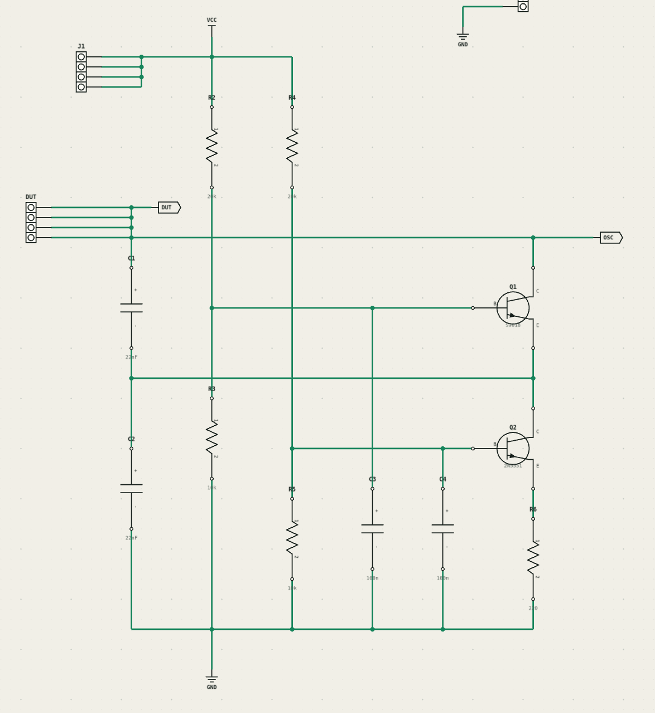
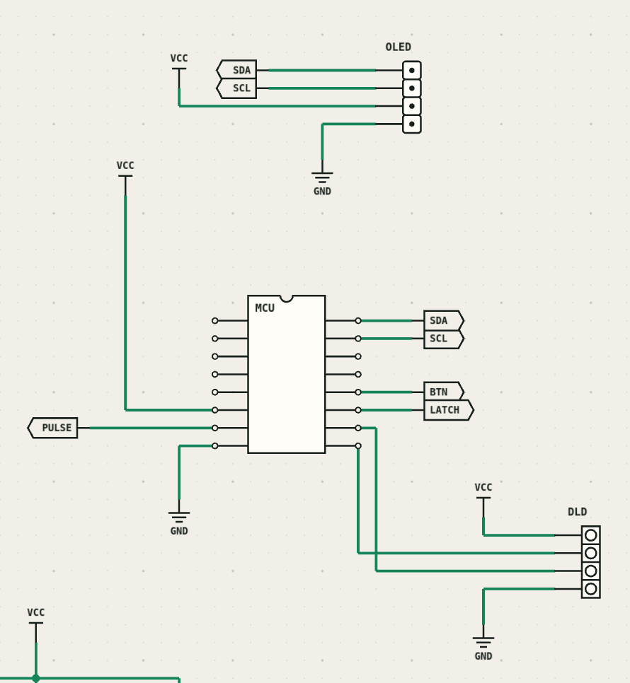
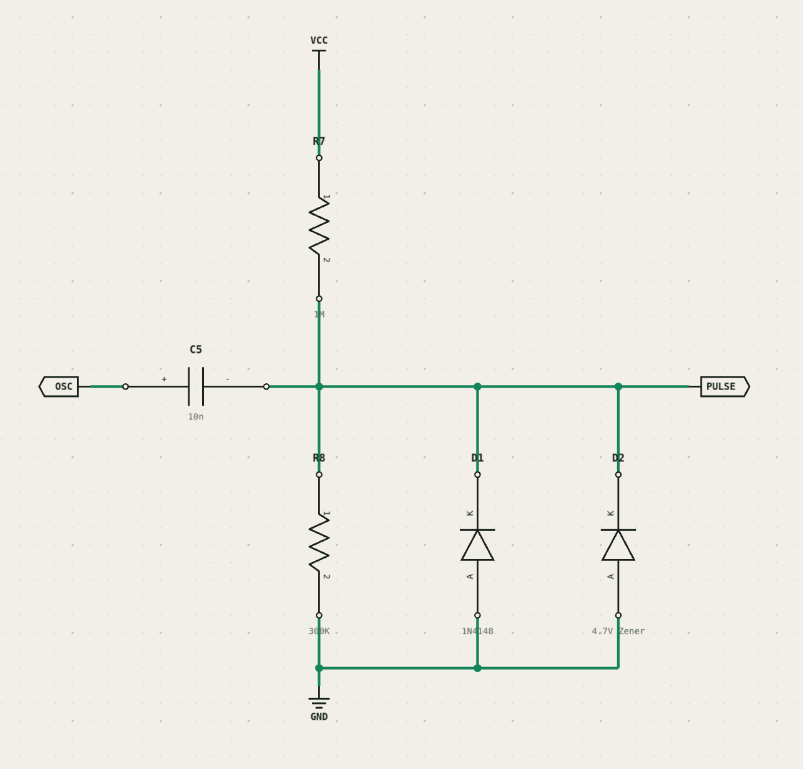
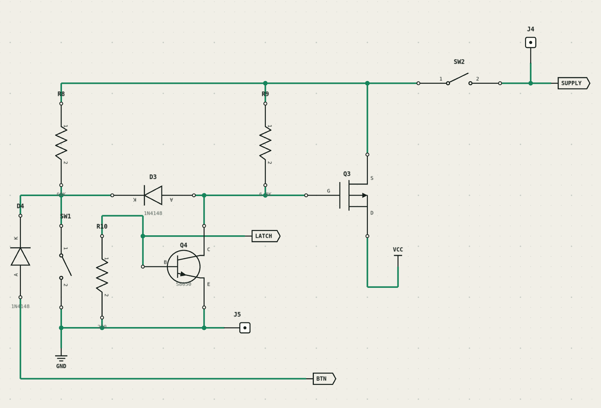

# STC15 Inductance Meter

A handheld inductance meter built around the **STC15W408AS** microcontroller.
An analog Colpitts oscillator converts the unknown inductance into a frequency,
and the firmware counts that signal, filters the result, applies calibration,
and shows the measured value on an SSD1306 OLED.

The project targets general-purpose measurements from approximately **10 uH to
1 H**. It is currently a prototype: the range and accuracy depend on oscillator
startup, component tolerances, inductor losses, layout, and calibration.

## Features

- 100 ms hardware-gated frequency measurements
- Integer-only inductance calculation suitable for an 8051-class MCU
- Kalman filtering for a steadier reading
- Automatic display units: `uH`, `mH`, and `H`
- SSD1306 OLED support at I2C address `0x3c` or `0x3d`
- Push-button power latch with hold-to-shut-down behavior
- Automatic shut-down after approximately three minutes without a changed reading
- UART debug support at 115200 baud
- Python calibration helper for fitting measured reference inductors

## How It Works

The unknown inductor is part of a Colpitts oscillator. With effective tank
capacitance `Ceq`, its resonant frequency is approximately:

```text
f = 1 / (2 * pi * sqrt(L * Ceq))
```

The oscillator output is AC-coupled and limited before reaching the MCU's
comparator input. The comparator output drives the PCA external counter on
`P1.2`. Timer 0 provides a 100 ms measurement gate while the PCA counts pulses.

The firmware converts the filtered pulse count with a calibrated model of the
form:

```text
L = A / pulse_count^2 + B
```

The fitted constants absorb the effective tank capacitance, clock scale,
fixture inductance, and other repeatable offsets. The result is displayed in
microhenries, millihenries, or henries.

```text
Unknown inductor
       |
       v
Colpitts oscillator -> AC coupling / protection -> MCU comparator
                                                      |
                                                      v
                                  PCA pulse counter + 100 ms timer
                                                      |
                                                      v
                                  filter -> calibration -> OLED
```

## Hardware

The main sections are:

| Section | Purpose |
| --- | --- |
| STC15W408AS | Counts oscillator pulses and calculates inductance |
| Colpitts oscillator | Converts the DUT inductance into a frequency |
| Input coupling | Biases and limits the oscillator signal for the MCU |
| SSD1306 OLED | Displays the measured value and status messages |
| Power latch | Allows push-button startup and firmware-controlled shutdown |

Important firmware connections are:

| Signal | MCU pin | Notes |
| --- | --- | --- |
| Pulse input / ECI | `P1.2` | Comparator output and PCA external clock |
| OLED SCL | `P1.0` | Software I2C; external pull-up required |
| OLED SDA | `P1.1` | Software I2C; external pull-up required |
| Power latch | `P3.2` | Driven low to switch the instrument off |
| Push button | `P3.3` | Active low |

### Circuit Diagrams

| Oscillator | MCU and display |
| --- | --- |
|  |  |
| Input coupling and protection | Power latch |
|  |  |

For best stability and accuracy, use film capacitors (CBB for example) for the oscillator's
frequency-setting capacitors.

The diagrams capture the current prototype, but they are not yet a production
schematic or a validated bill of materials. See
[`oscillator-design.md`](oscillator-design.md) for component rationale,
expected frequencies, layout guidance, and the remaining validation work.

## Firmware

The firmware is C built with SDCC for the MCS-51 architecture. It assumes a
36 MHz MCU clock and uses only integer arithmetic in the measurement path.

### Prerequisites

- GNU Make
- SDCC, including `sdcc`, `sdas8051`, and `packihx`
- [`uv`](https://docs.astral.sh/uv/) for the Python tools and flashing command
- A supported USB-to-serial adapter for STC ISP
- `tio` if you want to use the serial-console target

Python 3.12 or newer is declared in `pyproject.toml`. Running a `uv` command
installs the required Python packages, including `stcgal` and `matplotlib`, into
the project environment.

### Build

```sh
make
```

The flashable image is written to:

```text
build/inductance_meter.hex
```

Remove generated build files with:

```sh
make clean
```

### Flash

Connect the programmer, run the command below, and follow the normal STC
power-cycle procedure when prompted:

```sh
make download
```

The target invokes `stcgal` with a 36 MHz target frequency. Pass the appropriate
port option directly to `stcgal` if automatic port detection does not select
your adapter.

### Serial Debugging

The debug UART uses 115200 baud. Open the configured serial device with:

```sh
make serial
```

The target currently uses `/dev/ttyUSB0`. Debug output is disabled by default,
so the console will remain quiet unless `DEBUG` is enabled in `src/debug.h` and
logging statements are enabled in the source.

## Operation

1. Connect an unpowered inductor to the DUT terminals.
2. Turn on the meter with the power button.
3. Read the measured inductance from the OLED.
4. Hold the button until `Hold to power off` appears and continue holding to
   switch the meter off.

If the reading remains unchanged for about three minutes, the display shows
`Power off in 5s`. Pressing the button during this warning cancels automatic
shutdown. A frequency above the supported counting range is reported as
`Underflow (<10uH)`.

This instrument measures small-signal inductance. It does not characterize an
inductor under DC bias or near core saturation. High winding resistance or low
Q can prevent the oscillator from starting or pull its frequency enough to
reduce accuracy.

## Calibration

Calibration data and the regression helper are in `calibrate.py`. Each point
pairs a characterized inductance with a measured squared pulse count. Update
the two data lists with measurements from your own assembled hardware, then
run:

```sh
uv run calibrate.py
```

The script prints the fitted slope and intercept and plots the calibration
points. The firmware constants are currently defined in `src/measure.c` as
`INDUCTOR_FREQUENCY_SCALE` and `INDUCTOR_FREQUENCY_OFFSET`. Account for the
fixed-point scaling described beside `pulse_count_to_uh()` when transferring a
new fit into the firmware.

Use at least two characterized reference inductors and validate against
additional parts that were not used for fitting. For meaningful validation,
include different inductance values, winding resistances, and core types.

## Repository Layout

```text
.
|-- circuit/                 Circuit diagram images
|-- lib/                     STC15 peripheral support code
|-- src/
|   |-- main.c               Main loop and power management
|   |-- measure.c            Pulse counting and inductance conversion
|   |-- filter.c             Integer Kalman filter
|   |-- display.c            SSD1306 driver and bitmap font
|   `-- format.c             Display-unit formatting
|-- calibrate.py             Calibration regression and plot
|-- frequency-measurement.md Frequency-counting notes
|-- oscillator-design.md     Analog design and validation notes
|-- Makefile                 Build, flash, and serial targets
`-- pyproject.toml           Python tooling dependencies
```
